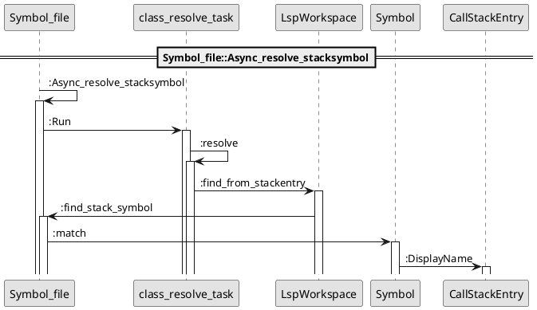

```plantuml
@startuml
skinparam monochrome true
autoactivate on
==Symbol_file::Async_resolve_stacksymbol==
Symbol_file -> Symbol_file::Async_resolve_stacksymbol
Symbol_file -> class_resolve_task::Run
class_resolve_task -> class_resolve_task::resolve
class_resolve_task -> LspWorkspace::find_from_stackentry
LspWorkspace -> Symbol_file::find_stack_symbol
Symbol_file -> Symbol::match
Symbol -> CallStackEntry::DisplayName
@enduml
```

